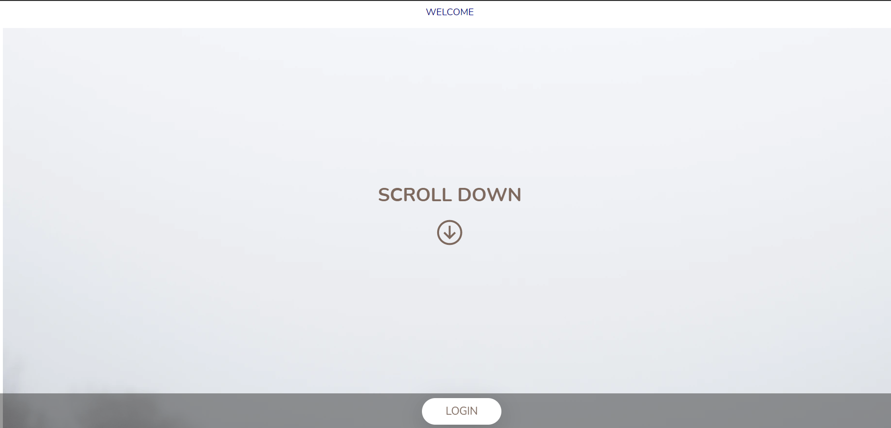
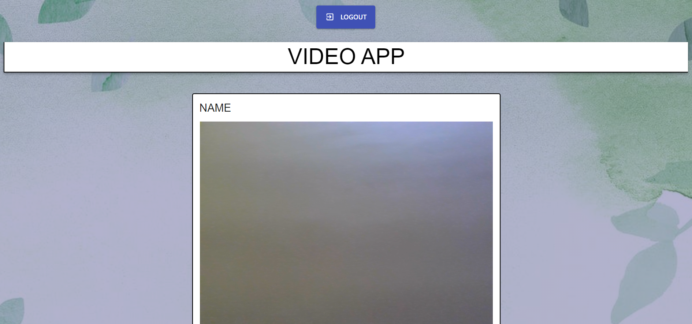

# Getting Started with Create React App

It basically starts with a login page, where we are supposed to login using email-id and password. Then we go to video calling application where users can call other user using an ID, and will also have the capabiltiy to mute their mic and audio. 

## Features and Functionalities 

- Video Call with others
- Mute audio/video
- Instantly join a video call with a code
- Share code instantly on social media platforms

## Screenshots 

### Home Page

### video call

### Incoming Call

### In Call

## Tech Stack

- [React.js](https://reactjs.org/)
- [Socket.io](https://socket.io/)
- [Node.js](https://nodejs.org/en/)
- [Auth0](https://auth0.com/)
- EJS
- JS
- CSS
- webrtc

## Available Scripts

In the project directory, you can run:

### `npm init -y`
Run the above command to create package.json files.

Run node index.js in the root directory

### `npm start`

Run the above command in the client directory
Open [http://localhost:5000](http://localhost:5000) to view it in the browser.

The page will reload if you make edits.\

